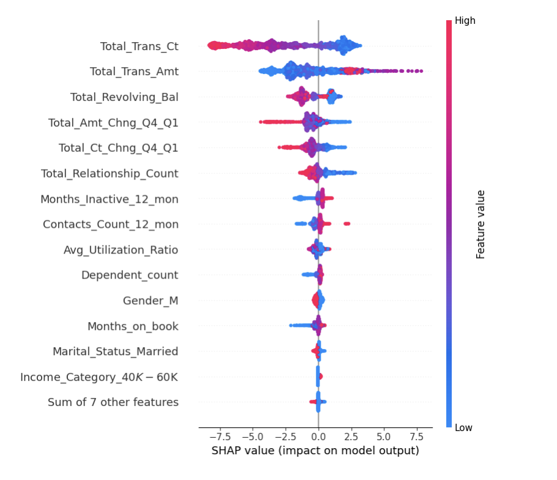
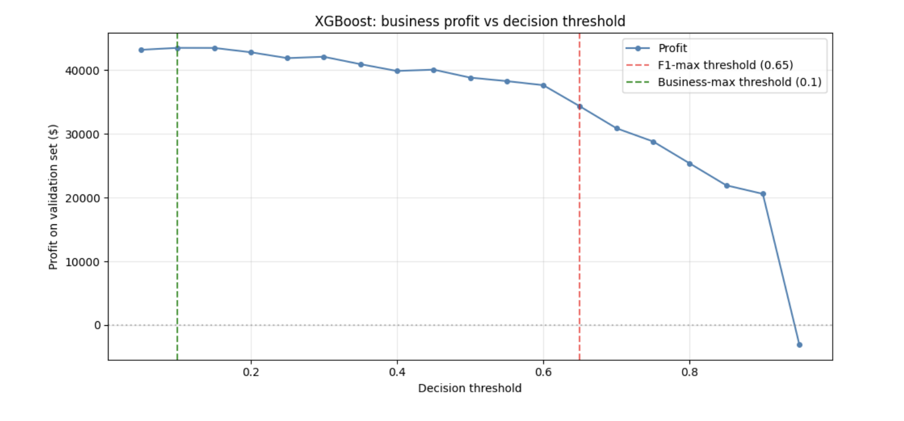

# Credit Card Churn Prediction

This project predicts which credit card customers are about to close their account, so a bank can reach out before they leave. The goal is not only to find these customers early, but also to explain why each one was flagged.

## The problem

A bank wants to know which customers are about to leave. The dataset has 10,127 customers and 21 features per customer. About 16 percent have already left, so the classes are not balanced.

The model has to do two things at once. It has to be predictive, to catch leaving customers early. It also has to be readable, because the bank wants to understand why a customer was flagged, not just receive a score.

## Data and preprocessing

The five categorical features are encoded with one-hot encoding. Numeric features are standardized with a scaler that is fit on the training set only, so no information leaks from validation or test.

The class imbalance is handled by reweighting the classes, not by oversampling or undersampling. Linear and tree models use balanced class weights, and XGBoost uses a positive class weight of 5.22.

The data is split into train, validation and test with stratified sampling (70 / 15 / 15). All tuning uses 5-fold stratified cross validation. The scoring metric is average precision (area under the precision recall curve), which is a good fit for an imbalanced problem.

## Approach

Three approaches were compared, all tuned the same way:

1. Lasso (L1) for feature selection, then Random Forest on the features that survive.
2. Random Forest on the full feature set.
3. XGBoost on the reduced feature set.

The Lasso step keeps 21 features out of 32. Comparing the reduced and full Random Forest shows that the smaller feature set does not hurt performance, so the rest of the work uses the reduced set.

## Results

| Model | CV AUPR | Validation AUPR |
| --- | --- | --- |
| Random Forest, reduced (21 features) | 0.930 | 0.920 |
| Random Forest, full (32 features) | 0.926 | 0.919 |
| XGBoost | 0.966 | 0.975 |

XGBoost is the best model. On validation, tuning the decision threshold shows that the default value of 0.5 is too cautious, and the F1 score is highest around 0.65.

## Interpretability

Four independent methods were used to measure feature importance: Lasso coefficients, the built in gain from XGBoost, permutation importance on the validation set, and SHAP values. They all agree on the same short list of features, which are mostly about customer behaviour: transaction count and amount, revolving balance, relationship count, and the Q4 over Q1 change ratios.

This agreement matters. It means the model can be explained to a non technical reader, and the explanation does not depend on the method you pick.



SHAP can also explain a single customer. For one flagged customer, a waterfall plot shows which features pushed the score up and which pushed it down, so the bank can read a clear reason for each case.

## A business view of the threshold

A churn model is only useful if the bank acts on it, and acting has a cost. The project adds a simple profit function that gives a value to each outcome:

Profit = (true positives x 200) minus (false positives x 30) minus (false negatives x 500)

Here 200 is the gain from saving a leaving customer, 30 is the cost of a false alarm, and 500 is the cost of missing a leaving customer. Because missing a customer is expensive, the profit is highest at a low threshold, where the model flags more people. This is well below the threshold that maximises F1.



## A second pipeline that avoids leakage

Some of the strongest features describe what the customer did during the process of leaving, not before it. Using them gives high scores, but the bank could not refresh them in time to act, so they are not safe for a real campaign.

To handle this, a second pipeline drops the six features that leak information from the future, and replaces them with three ratios that can always be computed from current data:

1. Transaction count per month (total transactions divided by months on book).
2. Average transaction value (total amount divided by total count).
3. Spending intensity (total amount divided by credit limit).

This second model is weaker, which is expected, and the project measures exactly how much weaker.

| Model on the test set | AUPR | Recall | Precision | Profit |
| --- | --- | --- | --- | --- |
| XGBoost, first pipeline | 0.943 | 0.98 | 0.62 | 41,500 |
| XGBoost, second pipeline | 0.791 | 0.95 | 0.48 | 32,750 |

The drop of about 21 percent in profit is the real, measured cost of using only features the bank can refresh. Showing this number is the point: it turns a hidden risk into a clear trade off.

## What I would deploy

I would deploy the second XGBoost for the monthly retention campaign, because it only uses features the bank can actually refresh in time. I would keep the first XGBoost as an internal benchmark, to see how much performance is lost to the leakage fix. In both cases the feature importance is stable across four methods, so the model stays readable for a non technical audience.

## How to run

```
git clone https://github.com/ArnaudG16/credit-card-churn-prediction.git
cd credit-card-churn-prediction
jupyter notebook
```

Then open the notebook and run the cells in order.

## Files

The repository contains the analysis notebook, the slide deck that presents the results, and a short report. The dataset is a public bank churn dataset of 10,127 customers.
